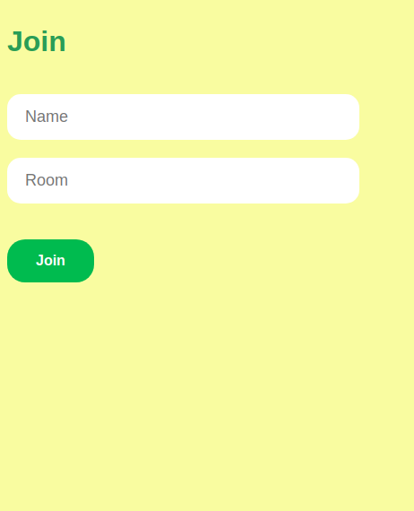
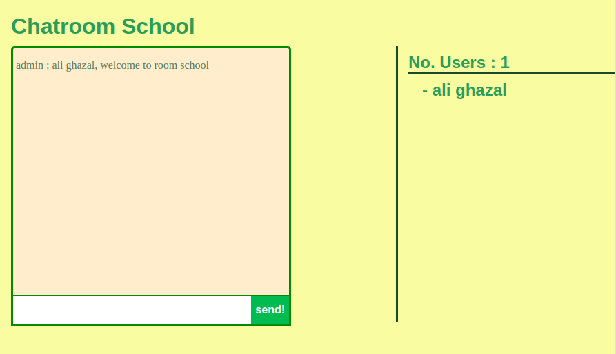

# the Chatroom Room

This is a chatting application built using react, express, socket.io

In its current form (15th Jan 2021), it contians to main screens: Join an Chat

here is a screenshot of the current development:

join|chat
----|-----
| 

## What's next:
- [ ] add persistance to the chat data (postgress)
- [ ] add setting to change color 
- [ ] add different colors to different users
- [ ] show all active rooms in the welcome page 
- [ ] add users limit to each room 

